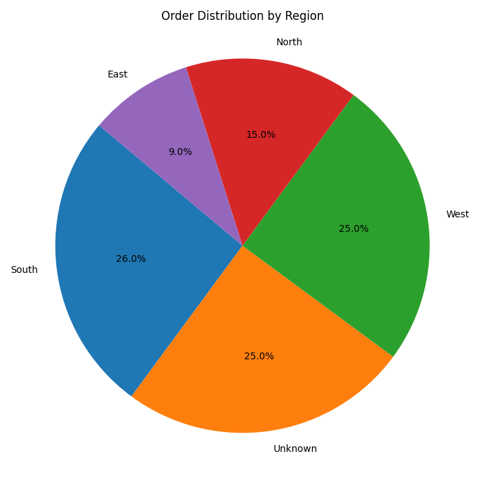

# DSA2040A ETL Midterm Project – Paul Mbuvi (ID: 984)

## 📌 Project Overview
This mini-project demonstrates a complete ETL (Extract, Transform, Load) pipeline built using Python. It processes sales order data by extracting it from raw CSV files, applying meaningful transformations, and loading it into structured formats (**Parquet** and **SQLite**). This work was done as part of the DSA2040A Mid Semester Exam.

---

## ⚙️ ETL Phases

### 1. Extract
- Loaded both `raw_data.csv` and `incremental_data.csv`
- Previewed data with `.head()` and `.info()`
- Identified missing values, nulls, and duplicates
- Saved original files to the `data/` folder

### 2. Transform
Applied the following transformations:
- Filled missing `quantity` and `unit_price` with median values
- Added a new column: `total_price = quantity * unit_price`
- Converted `order_date` to datetime format and extracted `order_month`
- Filled missing `region` values with `"Unknown"`
- Removed duplicate rows

Transformed outputs saved to:
- `transformed/transformed_full.csv`
- `transformed/transformed_incremental.csv`

### 3. Load
Loaded the transformed datasets into two structured formats:

#### ✅ Parquet Format:
- Used `pandas.to_parquet()` with `fastparquet` engine
- Files saved in `loaded/` folder:
  - `full_data.parquet`
  - `incremental_data.parquet`

#### ✅ SQLite Format:
- Used `sqlite3` to load datasets into SQLite databases
- Files saved in `loaded/` folder:
  - `full_data.db` (table: `full_data`)
  - `incremental_data.db` (table: `incremental_data`)

---

## 🧰 Tools Used
- Python
- pandas
- sqlite3
- fastparquet
- matplotlib
- Jupyter Notebook

---

## 📊 Visualization
Created a pie chart showing order distribution by region:



---

## ▶️ How to Run the Project

1. Clone this repository:
   ```bash
   git clone https://github.com/paulmbuvi/DSA2040A_ETL_Midterm_Paul_984.git
